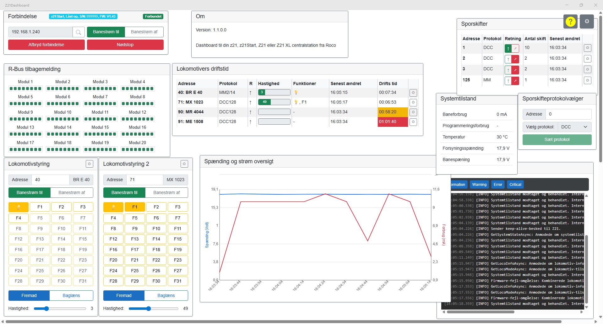
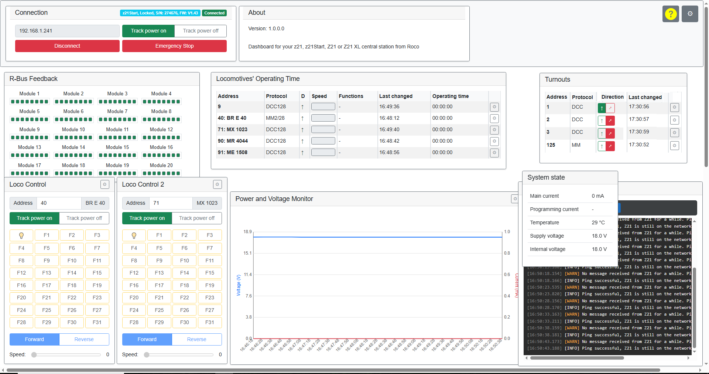

[Click here for English version](#z21dashboard-application-for-windows)

Danish version:
# Z21Dashboard applikation til Windows

En .NET MAUI Blazor Hybrid-applikation til Windows. Den fungerer som et funktionsrigt, brugerkonfigurerbart
dashboard til styring og overvågning af en Roco/Fleischmann Z21-modeljernbane-centralstation. Denne
applikation bruger `Z21Client`-biblioteket til at kommunikere med hardwaren.

Z21Client repo findes her:
[https://github.com/J-Wachs/Z21Client](https://github.com/J-Wachs/Z21Client)

Z21Dashboard (og Z21Client) er udvikler efter "AI Pair Programming" metoden.

## Nyheder i denne version 

Version 1.1:
* Upgraderet til .NET 10. Vær opmærkom på, at du skal bruge Visual Studio 2026 arbejde med denne version.
 

## Egenskaber

Z21Dashboard tilbyder en moderne og interaktiv brugerflade med følgende nøglefunktioner:

*   **Sprogversionering:** Afvikles applikationen med sprog sat til dansk, vises danske tekster, ellers engelske.
*   **Dynamisk "Træk-og-slip"-dashboard:** Brugere kan frit flytte og omarrangere komponent-vinduer på et "frit lærred" for at skabe et personligt layout.
*   **Brugerkonfigurerbart Layout:** Et centralt indstillingspanel giver brugerne mulighed for at vise eller skjule individuelle komponent-vinduer, så de kan skræddersy dashboardet til deres specifikke behov.
*   **Permanent Layout:** Brugerens tilpassede layout, inklusiv komponenters positioner og synlighed, gemmes automatisk og gendannes mellem applikationens sessioner.
*   **Clean Architecture:** Applikationen er bygget ved hjælp af Clean Architecture-principper, hvilket sikrer en klar adskillelse af ansvarsområder mellem forretningslogik, applikationsinfrastruktur og brugergrænsefladen.
*   **Realtidsovervågning:** Komponenterne abonnerer på live datastrømme fra `Z21Client` for at vise statusopdateringer i realtid for:
    *   Lokomotivers hastighed, retning og funktioner.
    *   Status for banestrøm ("Track Power").
    *   Sporskifters position.
    *   Overordnet systemstatus, strømforbrug og spænding.
    *   R-Bus feedback og RailCom-data.
*   **Interaktiv Styring:** Tilbyder en dedikeret `LocoControl`-komponent til realtidsstyring af et valgt lokomotivs hastighed, retning og funktioner.
*   **Lagring af Indstillinger:** Nøgleindstillinger, såsom Z21'ens IP-adresse og brugerdefinerede lokomotivnavne, gemmes lokalt, hvilket giver en gnidningsfri oplevelse ved efterfølgende opstarter.

## Dashboard-komponenter (Widgets)

Dashboardet er sammensat af flere specialiserede widgets, hver med en specifik funktion. Alle widgets kan flyttes
og skjules af brugeren.

*   **Forbindelses-visning:** Hovedkontrolpanelet til at etablere og overvåge forbindelsen til Z21. Tilbyder også hovedkontroller for Skinnestrøm ("Track Power") og Nødstop.
*   **Lokomotiv-styring:** Et realtidskontrolpanel for et enkelt lokomotiv. Brugere kan indtaste en lokomotivadresse for at overvåge og styre dets hastighed, retning og funktioner (F0-F31).
*   **Lokomotiver med driftstid:** Viser en detaljeret liste over aktive lokomotiver, sporer deres samlede driftstid og nuværende status. Giver brugerne mulighed for at tildele egne navne til lokomotiv-adresser.
*   **Diagram med strømforbrug:** En live-opdaterende graf, der overvåger og viser spidsbelastninger i strømforbrug (mA) og skinnespænding (V) fra Z21'en.
*   **Lokomotiv-slots:** Viser status for de 120 interne lokomotiv-"slots" i Z21-hukommelsen, hvilket giver et lav-niveau overblik. Denne komponent er baseret på ikke dokumenterede informationer.
*   **Sporskifter:** En liste, der viser den nuværende position (f.eks. ligeud eller afvigende) for alle sporskifter, der for nylig er blevet betjent.
*   **Systemstatus (Simpel & Fuld):** To widgets, der viser tekniske data fra Z21. Den simple visning viser nøgletal som strøm og spænding, mens den fulde visning giver en detaljeret oversigt over alle status-flag.
*   **R-Bus & RailCom-visninger:** Specialiserede widgets til overvågning af feedback fra R-Bus-moduler og data fra RailCom-udstyrede lokomotiver.

## Hvordan det virker

Z21Dashboard er bygget som en **.NET MAUI Blazor Hybrid**-applikation ved hjælp af **.NET 10**. Denne arkitektur gør
det muligt for en moderne web-baseret brugerflade (bygget med Blazor-komponenter) at køre som en native
desktop-applikation på Windows.

Z21Dashboard modtager hændelser fra Z21 centralstationen, og disse hændelser tolkes og afspejles på dashboardet. Det
betyder, at benytter du Z21 appen, multiMAUS eller wlanMAUS, så afspejles aktiviteten på disse, i dashboardet.

### Kerne-arkitekturkoncepter:

*   **Dynamisk Komponent-rendering:** Dashboard-lærredet bruger Blazors `<DynamicComponent>` til kun at rendere de vinduer, som brugeren har valgt at gøre synlige. Dette sikrer optimal ydeevne.
*   **Centraliseret Tilstandsstyring:** En singleton-service, `DashboardStateService`, fungerer som den eneste kilde til sandhed for dashboardets layout. Den er ansvarlig for at indlæse, flette og gemme brugerens konfiguration.
*   **Brugerdefineret Træk-og-slip:** Grundet et kendt problem i .NET MAUI Blazor WebView ([dotnet/maui#2205](https://github.com/dotnet/maui/issues/2205)), er en brugerdefineret, robust træk-og-slip-mekanisme baseret på fundamentale muse-events (`mousedown`, `mousemove`, `mouseup`) blevet implementeret.
*   **Event-drevet Brugerflade:** Komponenterne er afkoblede og reagerer på ændringer ved at abonnere på events fra singleton-services (som `IDashboardStateService` og `IZ21Client`).
*   **Lagring af Indstillinger:** Alle brugerindstillinger gemmes i en enkelt `app_data.json`-fil i brugerens lokale `AppData/Roaming`-mappe, håndteret af en dedikeret `AppDataService`.

## Kom Godt I Gang

For at køre Z21Dashboard-applikationen skal du have .NET 10 SDK installeret.

Hvis du vil se og lave din egen version af Z21Dashboard, følg punkterne herunder. Vil du blot have selve
applikationen og bruge den, da skal du downloade den køreklar udgave.

1.  Klon "repository'et" fra GitHub
2.  Åbn løsningsfilen (`.sln`) i Visual Studio 2026
3.  Sørg for, at `Z21Dashboard`-projektet er sat som opstartsprojekt
4.  Kør applikationen (tryk F5)

## Ofte Stillede Spørgsmål (FAQ)

### Hvorfor bruges en brugerdefineret træk-og-slip-implementering?

Som detaljeret i GitHub-sagen [dotnet/maui#2205](https://github.com/dotnet/maui/issues/2205), bliver standard HTML5 træk-og-slip-events ikke korrekt sendt igennem .NET MAUI Blazor WebView. Den brugerdefinerede implementering via muse-events giver et pålideligt og højtydende alternativ.

### Hvordan tilføjer jeg en ny komponent til dashboardet?

1.  Opret din nye Blazor-komponent.
2.  Åbn `DashboardStateService.cs` og tilføj en post for din nye komponent i `GetDefaultComponentDefinitions()`-metoden.
3.  Hvis nødvendigt, opdater `Dashboard.razor`'s `UpdateComponentParameters()`-metode for at levere parametre til din nye komponent.

Eksisterende brugere vil automatisk se den nye komponent i deres indstillingspanel ved næste opstart.

### Hvorfor er der ingen widgets til LocoNet og CAN-bus?

Jeg har en z21Start og derfor, ingen LocoNet eller CAN-bus enheder jeg kan upvikle til, og teste med. Du er
velkommen til at udvikle den nødvendige funktionalitet i Z21Client og i Z21Dashboard.

## Fundet en fejl?

Opret venligst en "issue" i "repository'et".

# Z21Dashboard application for Windows

A .NET MAUI Blazor Hybrid application for Windows. It serves as a feature-rich, user-configurable dashboard for
controlling and monitoring a Roco/Fleischmann Z21 model railroad central station. This application uses
the `Z21Client` library to communicate with the hardware.

The Z21Client repo can be found here:
[https://github.com/J-Wachs/Z21Client](https://github.com/J-Wachs/Z21Client)

Z21Dashboard (and Z21Client) has been developed using the 'AI Pair Programming' method.

## Features

The Z21Dashboard provides a modern and interactive user interface with the following key features:

*   **Multi language:** If the application is running with the language set to Danish, Danish texts are displayed, otherwise English texts.
*   **Dynamic, Drag-and-Drop Dashboard:** Users can freely move and rearrange component windows on a "free-form" canvas to create a personalized layout.
*   **User-Configurable Layout:** A central settings panel allows users to show or hide individual component windows, tailoring the dashboard to their specific needs.
*   **Persistent Layout:** The user's custom layout, including component positions and visibility, is automatically saved and restored between application sessions.
*   **Clean Architecture:** The application is built using Clean Architecture principles, ensuring a clear separation of concerns between business logic, application infrastructure, and the user interface.
*   **Real-time Monitoring:** Components subscribe to live data streams from the `Z21Client` to display real-time status updates for locomotives, turnouts, system state, and more.
*   **Interactive Control:** Provides dedicated components for real-time control of locomotives and other model railroad elements.
*   **Settings Persistence:** Key settings, such as the Z21's IP address and user-defined locomotive names, are saved locally, providing a seamless experience on subsequent launches.

## Dashboard Components (Widgets)

The dashboard is composed of several specialized widgets, each with a specific function. All widgets can be moved
and hidden by the user.

*   **Connection View:** The main control panel for establishing and monitoring the connection to the Z21. Also provides master controls for Track Power and Emergency Stop.
*   **Loco Control:** A real-time control panel for a single locomotive. Users can enter a locomotive address to monitor and control its speed, direction, and functions (F0-F31).
*   **Loco List Operation Time:** Displays a detailed list of active locomotives, tracking their total operating time and current status. Allows users to assign custom names to locomotive addresses.
*   **Power Chart:** A live-updating line chart that monitors and displays the peak power consumption (mA) and track voltage (mV) from the Z21.
*   **Active Locomotives:** A simple list showing the real-time status (speed, direction, functions) of all locomotives currently being tracked by the Z21.
*   **Locomotive Slots:** Displays the status of the 120 internal locomotive "slots" in the Z21 memory, providing a low-level overview.
*   **Active Turnouts:** A list showing the current state (e.g., straight or divert) of all turnouts that have recently been operated.
*   **Loco/Turnout Protocol Selector:** Utility widgets that allow the user to query and set the protocol mode (e.g., DCC or Motorola) for a specific locomotive or turnout address.
*   **System State (Simple & Full):** Two widgets that display technical data from the Z21. The simple view shows key metrics like current and voltage, while the full view provides a detailed breakdown of all status flags.
*   **R-Bus & RailCom Views:** Specialized widgets for monitoring feedback from R-Bus modules and data from RailCom-equipped locomotives.

## What's New in this Version

Version 1.1:
* Upgraded to .NET 10. Note that you will need Visual Studio 2026 to work with this version

## How it Works

Z21Dashboard is built as a **.NET MAUI Blazor Hybrid** application using **.NET 10**. This architecture allows a
modern web-based UI (built with Blazor components) to run as a native desktop application on Windows.

The Z21Dashboard reveives events from the Z21 central station, and these events is interpreted and reflected
one the dashboard. That means, that if you use the Z21 app, multiMAUS eller wlanMAUS, then the actions are
reflected on the dashboard.

### Core Architectural Concepts:

*   **Dynamic Component Rendering:** The dashboard canvas uses Blazor's `<DynamicComponent>` to render only the windows that the user has chosen to make visible. This ensures optimal performance.
*   **Centralized State Management:** A singleton service, `DashboardStateService`, acts as the single source of truth for the dashboard's layout. It is responsible for loading, merging, and saving the user's configuration.
*   **Custom Drag-and-Drop:** Due to a known issue in the .NET MAUI Blazor WebView ([dotnet/maui#2205](https://github.com/dotnet/maui/issues/2205)), a custom, robust drag-and-drop mechanism based on fundamental mouse events (`mousedown`, `mousemove`, `mouseup`) has been implemented.
*   **Event-Driven UI:** Components are decoupled and react to changes by subscribing to events from singleton services (like `IDashboardStateService` and `IZ21Client`).
*   **Settings Persistence:** All user settings are saved to a single `app_data.json` file in the user's local `AppData/Roaming` directory, managed by a dedicated `AppDataService`.

## Getting Started

To run the Z21Dashboard application, you will need the .NET 10 SDK installed.

If you want to see and make your own version of Z21Dashboard, follow the steps below. If you just want to run the
application and use it, then you will have to download the run-able verison.

1.  Clone the repository from GitHub.
2.  Open the solution file (`.sln`) in Visual Studio 2026.
3.  Ensure the `Z21Dashboard` project is set as the startup project.
4.  Run the application (press F5).

## FAQ

### Why use a custom drag-and-drop implementation?

As detailed in the GitHub issue [dotnet/maui#2205](https://github.com/dotnet/maui/issues/2205), the standard
HTML5 drag-and-drop events are not correctly routed through the .NET MAUI Blazor WebView. The custom implementation
using mouse events provides a reliable and high-performance alternative.

### How do I add a new component to the dashboard?

1.  Create your new Blazor component.
2.  Open `DashboardStateService.cs` and add an entry for your new component to the `GetDefaultComponentDefinitions()` method.
3.  If needed, update `Dashboard.razor`'s `UpdateComponentParameters()` method to provide parameters to your new component.

Existing users will automatically see the new component in their settings panel upon next launch.

### Why is there no widgets for LocoNet and CAN-bus?

I have the z21Start and because of that, no LocoNet or CAN-bus devices I can develop for and test with. Please feel
free to develop the needed functionality in the Z21Client and in the Z21Dashboard.

## Found a bug?

Please create an issue in the repo.
