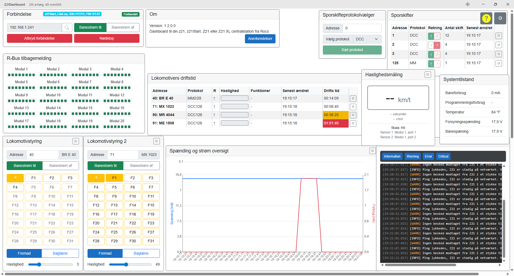
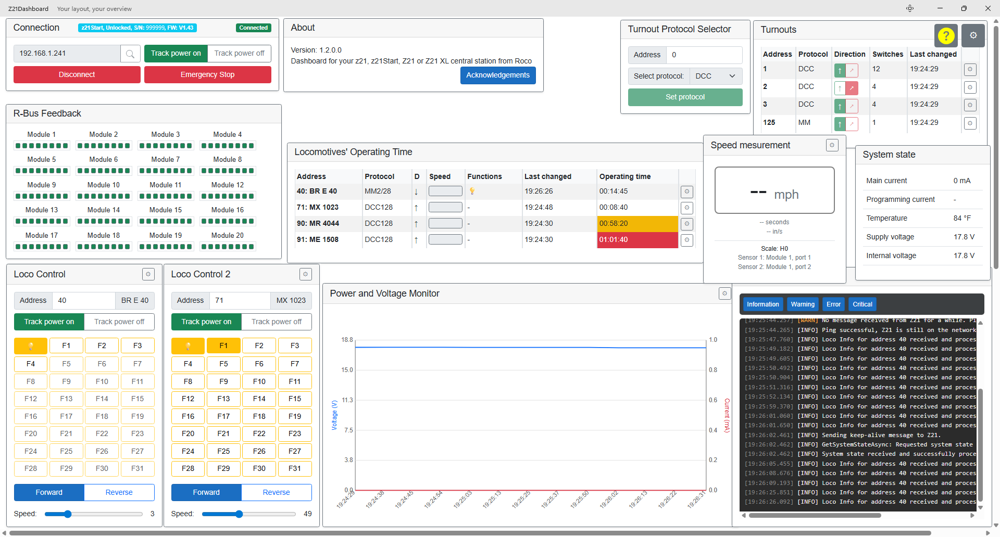

[Click here for English version](#z21dashboard-application-for-windows)

Danish version:
# Z21Dashboard applikation til Windows

En .NET MAUI Blazor Hybrid-applikation til Windows. Den fungerer som et funktionsrigt, brugerkonfigurerbart
dashboard til styring og overvågning af en Roco/Fleischmann Z21-modeljernbane-centralstation. Denne
applikation bruger mit `Z21Client`-biblioteket til at kommunikere med hardwaren.

I dokumentationen benyttes termen "widget". "Widget" dækker funktionalitet der afvikles i sit eget vindue på
dashboardet. 

Z21Client repo findes her:
[https://github.com/J-Wachs/Z21Client](https://github.com/J-Wachs/Z21Client)

Z21Dashboard (og Z21Client) er udvikler efter "AI Pair Programming" metoden.

## Nyheder i denne version 

Version 1.2:

For brugere:
* Z21Dashboard Settings er omdøbt til Konfiguration
* Konfiguration er opdelt i faner
* Tilføjet en fane med indstillinger: temperaturskala og modeltogsskala
* Ændringer i widgets System Status og System Status – Complete, så temperaturen vises i den valgte temperaturskala
* Ny widget “Hastighedsmåling” til måling af modeltogets hastighed og konvertering til hastighed i fuld skala
* Tilføjet knappen “Super Maximize” i titellinjen på dashboardets hovedvindue for at maksimere dashboardet til fuld skærm (på tværs af skærme)
* Tilføjet en “Anerkendelser”-knap og dialog i "Om" widgetten til at anerkende brugen af tredjepartsbiblioteker og -værktøjer i udviklingen af Z21Dashboard
* Tilføjet to ekstra lokomotivstyringer, så der i alt er fire lokomotivstyringer

For udviklere:
* DashboardStateService eksponerer nu en hændelse, som udløses, når indstillinger ændres
* Ny Blazor-komponent DraggableModal.razor til oprettelse af modale dialoger, der kan trækkes. Komponenten anvendes nu i alle widgets med modale dialoger (LocoController, Settings, Speed Measure osv.)
* Som en del af tilføjelsen af to ekstra lokomotivstyringer er koden for lokomotivstyringer blevet refaktoreret til at bruge ét sæt ressourcefiler

Fejlrettelser:
* RBus-widgetten anmodede ikke om RBus’ indledende tilstand
* I "Lokomotivstyring" widgets blev pladsholderteksten for serviceinterval ikke vist korrekt, når værdien ikke var angivet
* Ved opdatering af Z21Dashboard applikationen, blev de tidligere satte positioner og valg af widget nulstillet
  og alle widgets vist

## Målgruppe for applikationen

Der er to målgrupper for Z21Dashboard:

* Modeltogsentusiasten, der ønsker et overblik, som man ikke får ved at bruge multiMAUS, wlanMAUS eller den
  officielle Z21-app, men på samme tid ikke ønsker en mere kompliceret løsning, som software til at automatisere
  driften på modelbanen.
* Modeltogsentusiasten, der, udover ovenstående, ønsker at udvikle software til Z21, og derfor kan hente inspiration
  i Z21Dashboard eller bruge Z21Dashboard som afsæt til en ny applikation. Et ønske kunne være at udvide med CAN-bus
  og LocoNet-funktionalitet til Z21 (modeller i sort kabinet) centralstationerne.

## Egenskaber

Z21Dashboard tilbyder en moderne og interaktiv brugerflade med følgende nøglefunktioner:

*   **Sprogversionering:** Afvikles applikationen med sprog sat til dansk, vises danske tekster, ellers engelske.
*   **Dynamisk "Træk-og-slip"-dashboard:** Brugere kan frit flytte og omarrangere widgets på et "frit lærred"
    for at skabe et personligt layout.
*   **Brugerkonfigurerbart Layout:** Et centralt indstillingspanel giver brugerne mulighed for at vise eller skjule
    individuelle widgets, så de kan skræddersy dashboardet til deres specifikke behov.
*   **Permanent Layout:** Brugerens tilpassede layout, inklusiv widgets positioner og synlighed, gemmes automatisk
    og gendannes mellem applikationens sessioner.
*   **Clean Architecture:** Applikationen er bygget ved hjælp af Clean Architecture-principper, hvilket sikrer en klar
    adskillelse af ansvarsområder mellem logik, applikationsinfrastruktur og brugergrænsefladen.
*   **Realtidsovervågning:** De forskellige widgets abonnerer på live datastrømme fra `Z21Client` for at vise
    statusopdateringer i realtid for:
    *   Lokomotivers hastighed, retning og funktioner
    *   Status for banestrøm
    *   Sporskifters position
    *   Overordnet systemstatus, strømforbrug og spænding
    *   R-Bus feedback og RailCom-data
*   **Interaktiv Styring:** Tilbyder en dedikeret "Lokomotivstyring" widget til realtidsstyring af et valgt lokomotivs
    hastighed, retning og funktioner (kræver enten at z21/z21Start er låst op, eller en Z21/Z21 XL).
*   **Lagring af Indstillinger:** Nøgleindstillinger, såsom Z21'ens IP-adresse og brugerdefinerede lokomotivnavne,
    gemmes lokalt, hvilket giver en gnidningsfri oplevelse ved efterfølgende opstarter.

## Dashboard widgets

Dashboardet er sammensat af specialiserede widgets, hver med en specifik funktion. Alle widgets kan flyttes
og skjules af brugeren.

*   **Forbindelses-visning:** Bruges til at etablere og overvåge forbindelsen til Z21. Tilbyder også kontroller for
    skinnestrøm og Nødstop
*   **Lokomotiv-styring:** Lader brugeren vælge og køre samt overvåge et lokomotivs hastighed, retning og funktioner
    (F0-F31). Widget'en bliver opdateret med aktuelle data for det valgte lokomotiv i realtid, hvis det pågældende
    lokomotiv bliver styret fra en multiMAUS, wlanMAUS eller Z21 appen
*   **Lokomotiver med driftstid:** Viser en oversigt med lokomotiver som Z21 centralstationen (alle typer) styrer eller
    tidligere har styret. Den samlede driftstid og nuværende status vises. Brugeren har mulighed for at tildele egne
    navne til lokomotiv-adresser
*   **Diagram med strømforbrug:** En live-opdaterende graf, der overvåger og viser strømforbrug (mA) og skinnespænding
    (V) fra Z21'en
*   **Lokomotiv-slots:** Viser status for de 120 interne lokomotiv-"slots" i Z21-hukommelsen, hvilket giver et
    lav-niveau overblik. Denne komponent er baseret på ikke dokumenterede kald til Z21 centralstationen.
*   **Sporskifter:** En liste, der viser den nuværende position (f.eks. ligeud eller afvigende) for alle sporskifter,
    der for nylig er blevet betjent
*   **Systemstatus (Simpel & Fuld):** To widgets, der viser tekniske data fra Z21. Den simple visning viser nøgletal
    som strøm og spænding, mens den fulde visning giver en detaljeret oversigt over alle status-flag.
*   **R-Bus & RailCom-visninger:** Specialiserede widgets til overvågning af feedback fra R-Bus-moduler og data fra
    RailCom-udstyrede lokomotiver
*   **Hastighedsmåling:** Måler modeltogets hastighed og beregner den til skala 1:1

## Hvordan det virker

Z21Dashboard er bygget som en **.NET MAUI Blazor Hybrid**-applikation ved hjælp af **.NET 10**. Denne arkitektur gør
det muligt for en moderne web-baseret brugerflade (bygget med Blazor-komponenter) at køre som en native
desktop-applikation på Windows.

Z21Dashboard modtager hændelser fra Z21 centralstationen, og disse hændelser tolkes og afspejles på dashboardet. Det
betyder, at benytter du Z21 appen, multiMAUS eller wlanMAUS, så afspejles aktiviteten på disse, på dashboardet.

### Kerne-arkitekturkoncepter:

Er du interesseret i applikationens arkitektur og hvordan den er implementeret, så er her nogle af de vigtigste
koncepter:
*   **Dynamisk Komponent-rendering:** Dashboard-lærredet bruger Blazors `<DynamicComponent>` til kun at rendere de
    widgets, som brugeren har valgt at gøre synlige. Dette sikrer optimal ydeevne
*   **Centraliseret Tilstandsstyring:** En singleton-service, `DashboardStateService`, fungerer som den eneste kilde
    til sandhed for dashboardets layout. Den er ansvarlig for at indlæse, flette og gemme brugerens konfiguration
*   **Brugerdefineret Træk-og-slip:** Grundet et kendt problem i .NET MAUI Blazor WebView
    ([dotnet/maui#2205](https://github.com/dotnet/maui/issues/2205)), er en brugerdefineret,
    robust træk-og-slip-mekanisme baseret på fundamentale muse-events (`mousedown`, `mousemove`, `mouseup`) blevet
    implementeret
*   **Event-drevet Brugerflade:** Widgets er afkoblede og reagerer på ændringer ved at abonnere på events fra
    singleton-services (som `IDashboardStateService` og `IZ21Client`).
*   **Lagring af Indstillinger:** Alle brugerindstillinger gemmes i en enkelt `app_data.json`-fil i brugerens lokale
    `AppData/Roaming`-mappe, håndteret af en dedikeret `AppDataService`.

## Kom Godt I Gang

For at udvikle Z21Dashboard-applikationen skal du have .NET 10 SDK installeret.

Hvis du vil se og lave din egen version af Z21Dashboard, følg punkterne herunder. Vil du blot have selve
applikationen og bruge den, da skal du downloade den køreklar udgave.

1.  Klon "repository'et" fra GitHub
2.  Åbn løsningsfilen (`.sln`) i Visual Studio 2026
3.  Sørg for, at `Z21Dashboard`-projektet er sat som opstartsprojekt
4.  Kør applikationen (tryk F5)

## Ofte Stillede Spørgsmål (FAQ)

### Hvorfor bruges en brugerdefineret træk-og-slip-implementering?

Som beskrevet i GitHub-sagen [dotnet/maui#2205](https://github.com/dotnet/maui/issues/2205), bliver standard HTML5
træk-og-slip-events ikke korrekt sendt igennem .NET MAUI Blazor WebView. Den brugerdefinerede implementering via
muse-events giver et pålideligt og højtydende alternativ.

### Hvordan tilføjer jeg en ny widget til dashboardet?

1.  Opret din nye Blazor-komponent
2.  Åbn `DashboardStateService.cs` og tilføj en post for din nye widget i `GetDefaultComponentDefinitions()`-metoden
3.  Hvis nødvendigt, opdater `Dashboard.razor`'s `UpdateComponentParameters()`-metode for at levere parametre til din
    nye widget

Eksisterende brugere vil automatisk se den nye widget i deres indstillingspanel ved næste opstart.

### Hvorfor er der ingen widgets til LocoNet og CAN-bus?

Jeg har en z21Start og derfor ingen LocoNet eller CAN-bus enheder jeg kan upvikle til, og teste med. Du er
velkommen til at udvikle den nødvendige funktionalitet i Z21Client og i Z21Dashboard.

## Fundet en fejl?

Opret venligst en "issue" i "repository'et".

# Z21Dashboard application for Windows

A .NET MAUI Blazor Hybrid application for Windows. It functions as a feature-rich,
user-configurable dashboard for controlling and monitoring a Roco/Fleischmann
Z21 model railway central station. This application uses my `Z21Client` library
to communicate with the hardware.

In the documentation, the term "widget" is used. "Widget" refers to functionality
that runs in its own window on the dashboard.

Z21Client repo can be found here:
[https://github.com/J-Wachs/Z21Client](https://github.com/J-Wachs/Z21Client)

Z21Dashboard (and Z21Client) was developed using the "AI Pair Programming" method.

## What's New in This Version

Version 1.2:

For users:
* Z21Dashboard Settings has been renamed to Configuration
* Configuration is divided into tabs
* Added a tab with settings: temperature scale and model train scale
* Changes in widgets System Status and System Status – Complete to display
  temperature in the selected temperature scale
* New widget “Speed Measurement” to measure model train speed and convert it
  to full-scale speed
* Added a “Super Maximize” button in the title bar of the main dashboard
  window to maximize the dashboard across screens
* Added an “Acknowledgements” button and dialog in the "About" widget to credit
  third-party libraries and tools used in Z21Dashboard development
* Added two additional locomotive controls, making a total of four

For developers:
* DashboardStateService now exposes an event triggered when settings change
* New Blazor component DraggableModal.razor for creating draggable modal
  dialogs. Now used in all widgets with modal dialogs (LocoController,
  Settings, Speed Measure, etc.)
* As part of the two new locomotive controls, the code for locomotive controls
  was refactored to use a single set of resource files

Bug fixes:
* RBus widget did not request RBus initial state
* In "Locomotive Control" widgets, the placeholder for service interval
  did not display correctly when no value was set
* When updating the Z21Dashboard application the previously positions and the
  selected widget was reset and all widgets were shown

## Target Audience for the Application

There are two target groups for Z21Dashboard:

* The model train enthusiast who wants an overview not provided by multiMAUS,
  wlanMAUS, or the official Z21 app, but does not want a more complex solution
  such as software for automating model railway operations.
* The model train enthusiast who, in addition to the above, wants to develop
  software for the Z21, and can therefore draw inspiration from Z21Dashboard or
  use it as a starting point for a new application. One goal could be to expand
  with CAN-bus and LocoNet functionality for Z21 (black cabinet models) central
  stations.

## Features

Z21Dashboard offers a modern and interactive user interface with the following
key features:

*   **Language Versioning:** If the application is run with language set to
    Danish, Danish texts are displayed; otherwise English texts are shown.
*   **Dynamic Drag-and-Drop Dashboard:** Users can freely move and rearrange
    widgets on a "free canvas" to create a personalized layout.
*   **User-Configurable Layout:** A central settings panel allows users to show
    or hide individual widgets to tailor the dashboard to their needs.
*   **Persistent Layout:** The user's customized layout, including widget
    positions and visibility, is automatically saved and restored between
    sessions.
*   **Clean Architecture:** Built using Clean Architecture principles, ensuring
    a clear separation of concerns between logic, application infrastructure,
    and the user interface.
*   **Real-Time Monitoring:** Widgets subscribe to live data streams from
    `Z21Client` to show real-time status updates for:
    *   Locomotive speed, direction, and functions
    *   Track power status
    *   Switch positions
    *   Overall system status, current, and voltage
    *   R-Bus feedback and RailCom data
*   **Interactive Control:** Provides a dedicated "Locomotive Control" widget
    for real-time control of a selected locomotive's speed, direction, and
    functions (requires either an unlocked z21/z21Start, or a Z21/Z21 XL).
*   **Settings Storage:** Key settings, such as the Z21 IP address and
    user-defined locomotive names, are stored locally for a seamless experience
    across restarts.

## Dashboard Widgets

The dashboard consists of specialized widgets, each with a specific function.
All widgets can be moved and hidden by the user.

*   **Connection View:** Used to establish and monitor the connection to Z21.
    Also provides controls for track power and emergency stop.
*   **Locomotive Control:** Allows the user to select, run, and monitor a
    locomotive's speed, direction, and functions (F0-F31). The widget updates
    in real time if the locomotive is controlled from multiMAUS, wlanMAUS, or
    the Z21 app.
*   **Locomotives with Runtime:** Displays an overview of locomotives controlled
    by the Z21 central station (all types) or previously controlled. Shows total
    runtime and current status. Users can assign custom names to locomotive
    addresses.
*   **Power Consumption Chart:** A live-updating graph showing current (mA) and
    track voltage (V) from the Z21.
*   **Locomotive Slots:** Displays the status of the 120 internal locomotive
    slots in Z21 memory, providing a low-level overview. Based on undocumented
    calls to the Z21 central station.
*   **Switches:** A list showing the current positions (e.g., straight or
    diverging) of all recently operated switches.
*   **System Status (Simple & Full):** Two widgets showing technical data from
    Z21. The simple view shows key figures like current and voltage; the full
    view provides a detailed overview of all status flags.
*   **R-Bus & RailCom Views:** Specialized widgets for monitoring feedback
    from R-Bus modules and RailCom-equipped locomotives.
*   **Speed Measurement:** Measures model train speed and calculates full-scale
    speed.

## How It Works

Z21Dashboard is built as a **.NET MAUI Blazor Hybrid** application using **.NET 10**. 
This architecture allows a modern web-based interface (built with Blazor components)
to run as a native desktop application on Windows.

Z21Dashboard receives events from the Z21 central station, which are interpreted
and reflected on the dashboard. This means activity from the Z21 app, multiMAUS,
or wlanMAUS is mirrored on the dashboard.

### Core Architecture Concepts

For those interested in the application architecture and implementation, here
are some key concepts:

*   **Dynamic Component Rendering:** The dashboard canvas uses Blazor’s
    `<DynamicComponent>` to render only the widgets chosen by the user, ensuring
    optimal performance.
*   **Centralized State Management:** A singleton service, `DashboardStateService`,
    serves as the single source of truth for the dashboard layout. It loads,
    merges, and saves the user's configuration.
*   **Custom Drag-and-Drop:** Due to a known issue in .NET MAUI Blazor WebView
    ([dotnet/maui#2205](https://github.com/dotnet/maui/issues/2205)), a robust,
    custom drag-and-drop mechanism based on fundamental mouse events
    (`mousedown`, `mousemove`, `mouseup`) has been implemented.
*   **Event-Driven UI:** Widgets are decoupled and respond to changes by subscribing
    to events from singleton services (like `IDashboardStateService` and `IZ21Client`).
*   **Settings Storage:** All user settings are saved in a single `app_data.json`
    file in the user's local `AppData/Roaming` folder, managed by a dedicated
    `AppDataService`.

## Getting Started

To develop the Z21Dashboard application, you need the .NET 10 SDK installed.

If you want to view and build your own version of Z21Dashboard, follow the steps
below. To just use the application, download the ready-to-run version.

1.  Clone the repository from GitHub
2.  Open the solution file (`.sln`) in Visual Studio 2026
3.  Make sure the `Z21Dashboard` project is set as the startup project
4.  Run the application (press F5)

## Frequently Asked Questions (FAQ)

### Why use a custom drag-and-drop implementation?

As described in GitHub issue [dotnet/maui#2205](https://github.com/dotnet/maui/issues/2205),
standard HTML5 drag-and-drop events are not properly passed through .NET MAUI Blazor
WebView. The custom implementation using mouse events provides a reliable, high-
performance alternative.

### How do I add a new widget to the dashboard?

1.  Create your new Blazor component
2.  Open `DashboardStateService.cs` and add an entry for your new widget in the
    `GetDefaultComponentDefinitions()` method
3.  If needed, update `Dashboard.razor`'s `UpdateComponentParameters()` method to
    pass parameters to your new widget

Existing users will automatically see the new widget in their settings panel at
next startup.

### Why are there no widgets for LocoNet and CAN-bus?

I have a z21Start and therefore no LocoNet or CAN-bus devices to develop and test
with. You are welcome to implement the required functionality in Z21Client and
Z21Dashboard.

## Found a Bug?

Please create an "issue" in the repository.